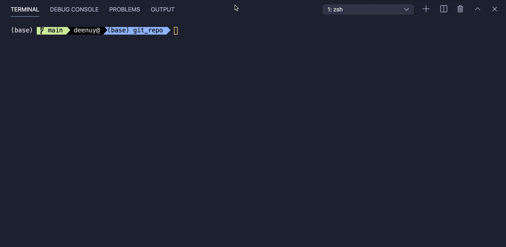

# UofT-employee-tracker-mysql-CLI
This is a CLI interface app that make it easy for non-developers to view and interact with information stored in databases. The application is developed for managing a company's employees using technology stack of node js, inquirer, and MySQL.

## Usecase:
As a business owner
I want to be able to view and manage the departments, roles, and employees in my company
So that I can organize and plan my business

## Technology Stack
* node js (inquirer, console.table, mysql)
* MySQL

## Usage
* clone the repository 
* create database and schema from the file `db/et_schema.sql` 
* insert sample data from `db/seed.sql`
* open mac terminal or windows dos prompt and navigate to git repo
* run node employeeTracker.js

## Demo
